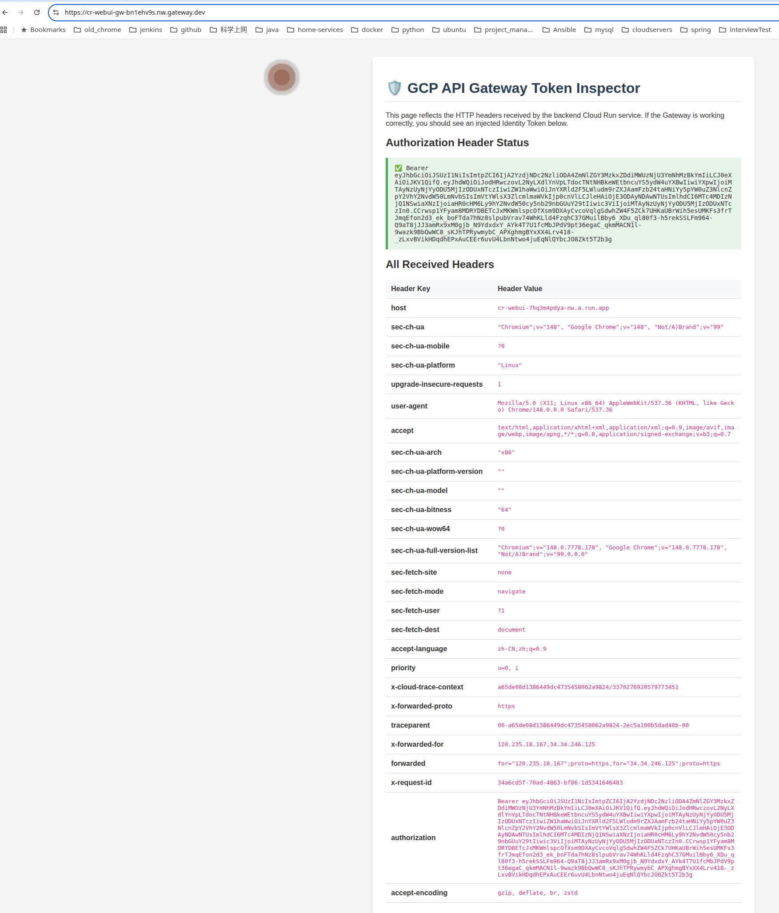
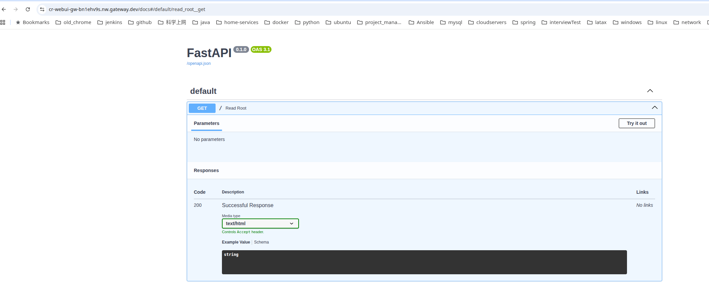

# GCP API Gateway & Cloud Run Identity Token Auth Experiment

## 🌟 项目简介 (Introduction)
本项目是一个完整的端到端实验，旨在解决企业级 GCP 环境（如受 Org Policy 严格限制的环境）下，**内部 Cloud Run 服务无法直接暴露公网访问**的架构痛点。

在严格的合规要求下，Cloud Run 必须配置为 `--no-allow-unauthenticated`（禁止 `allUsers` 访问）。为了让外部合法客户端能够安全访问该服务，本项目引入了 **GCP API Gateway** 作为前置网关。网关通过 OpenAPI (Swagger 2.0) 规范中的 `x-google-backend` 扩展插件，利用专属的 Service Account (`gateway-invoker`) 自动向 GCP 换取 Identity Token 并注入到 HTTP 请求头中，从而实现对内部 Cloud Run 的无缝鉴权与安全转发。

本项目不仅跑通了底层的鉴权转换链路，还包含了完整的 Web UI 靶标测试应用、自动化 CI/CD 流水线（GitHub Actions）以及配套的基础设施一键部署脚本。

## 📁 目录结构 (Project Structure)
```text
.
├── .github/workflows/   # CI/CD 自动化流水线 (使用 JSON Key 鉴权)
│   └── deploy.yml       # 将靶标应用自动构建、打包并部署至 Cloud Run
├── app/                 # Web UI 靶标项目 (FastAPI)
│   ├── main.py          # 后端逻辑，用于反射并打印接收到的 HTTP Headers
│   ├── templates/       # 前端 HTML 模板，直观展示网关注入的 Identity Token
│   └── Dockerfile       # 容器化构建文件
├── docs/                # 实验文档与详细说明
│   ├── EXPERIMENT_OVERVIEW.md  # 实验背景、阶段目标与交付标准验收结果
│   ├── ARCHITECTURE.md  # 架构设计说明
│   └── IAM_SETUP.md     # IAM 权限模型说明
├── gateway/             # API Gateway 配置与部署
│   ├── openapi.yaml     # 核心路由与鉴权配置文件 (含详细中文注释及 Token 挂载逻辑)
│   └── deploy-gateway.sh# API Gateway 及 API Config 的自动化部署脚本
├── infra/               # 基础设施与权限初始化脚本
│   └── init-iam.sh      # 一键创建 Service Accounts (如 GitHub/Gateway 所需) 并绑定 IAM Role
├── images/              # 架构图及验证效果截图
├── drawio/              # 架构图的 draw.io 原型源文件
└── README.md            # 项目主说明文档 (This file)
```

## 🚀 核心架构与鉴权机制 (Core Mechanism)
1. **外部访问**：外部用户发起的“裸请求”（未携带任何凭证）直接打向 API Gateway 的公网地址。
2. **网关拦截与转换**：Gateway 拦截请求并解析 `openapi.yaml`，识别出目标路由挂载了 `x-google-backend` 扩展。
3. **Identity Token 换取**：Gateway 使用预先绑定的 `gateway-invoker` Service Account，向 GCP 临时申请一枚 Identity Token (JWT)。
4. **安全穿透**：Gateway 将 Token 作为 `Bearer` 凭证写入 `Authorization` 请求头，成功敲开被 `--no-allow-unauthenticated` 锁死的 Cloud Run 大门。
5. **正常响应**：Cloud Run 鉴权通过并返回业务数据 (Web UI HTML)，网关再将其原路透传给最终用户的浏览器。

## 📖 详细文档
关于本实验的演进过程和交付标准，请前往查看：[EXPERIMENT_OVERVIEW.md](docs/EXPERIMENT_OVERVIEW.md)

## 🎯 实验成果展示 (Experiment Results)

**最终网关公网访问入口**：`https://cr-webui-gw-bn1ehv9s.nw.gateway.dev`
*(注：网关已开放公网访问，但后端的 Cloud Run 服务依旧保持严格的 `--no-allow-unauthenticated` 锁定状态)*

### 1. 鉴权与 Token 注入验证 (Token Inspector)
通过浏览器直接访问 API Gateway，网关在底层成功使用 `gateway-invoker` Service Account 换取了 Identity Token，并将其无缝注入到了 HTTP 请求头的 `Authorization` 字段中。Cloud Run 接收到合法 Token 后放行，成功渲染出页面：



### 2. 子路径代理验证 (FastAPI Swagger UI)
借助 `openapi.yaml` 中的 `/**` 通配符路由配置与 `APPEND_PATH_TO_ADDRESS` 特性，网关完美代理了 FastAPI 原生的 `/docs` 接口及其关联的静态资源请求：


