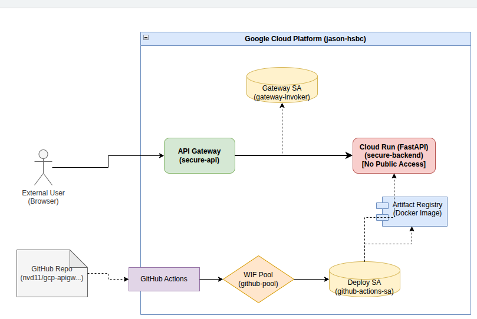

# Architecture: API Gateway to Internal Cloud Run

## Objective
Route external traffic through GCP API Gateway to a securely locked Cloud Run service (`--no-allow-unauthenticated`) without requiring the client to provide a GCP Identity Token.

## Architecture Diagram

## Mechanism
### 1. Data Plane (Request Flow)
- **External User (Browser)**: Sends a standard HTTP GET request without any GCP Identity Token.
- **API Gateway (`secure-api`)**: Intercepts the request at the edge.
- **Gateway SA (`gateway-invoker`)**: The Gateway acts as this Service Account to automatically fetch a fresh OIDC Identity Token from GCP IAM.
- **Cloud Run (`secure-backend`)**: Receives the request with the `Authorization: Bearer <token>` header appended. It validates the token and serves the FastAPI Web UI.

### 2. Control Plane (CI/CD Flow)
- **GitHub Repo**: Houses the FastAPI code and GitHub Actions workflow (`deploy.yml`).
- **GitHub Actions**: Triggers on code push.
- **WIF Pool (`github-pool`)**: Verifies the incoming OIDC token from GitHub Actions without needing a static JSON key.
- **Deploy SA (`github-actions-sa`)**: GitHub Actions impersonates this SA to gain temporary, elevated permissions in the GCP project.
- **Artifact Registry**: Receives the newly built Docker image (`docker push`).
- **Cloud Run**: Receives the deployment command (`gcloud run deploy`) to pull the image and restart the service.

## Resources
- **Project**: `jason-hsbc`
- **Region**: `europe-west2` (London) - *Enforced by Org Policy*
- **API Gateway**: `secure-api`
- **Cloud Run**: `secure-backend` (FastAPI)
- **Service Accounts**: 
  - `gateway-invoker` (Role: `run.invoker`)
  - `github-actions-sa` (Roles: `run.admin`, `artifactregistry.writer`, `iam.serviceAccountUser`)
